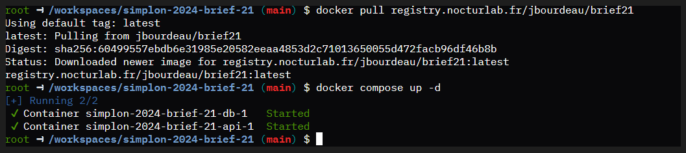

#  Rust API Deployment

- Rust
- Docker & Docker Compose
- Un domaine configuré avec Traefik
- Un serveur distant accessible via SSH
- Secrets GitHub configurés pour le déploiement
## 1 Démarrer le projet en Local : 
    inserer le dossier dans un IDE : 
    Compiler et Exécuter avec la commande : 
    ```
    cargo build --release
    cargo run
    ```
## 2 Demarrage avec Docker : 
    - docker build -t registry.nocturlab.fr/jbourdeau/brief21 .
    - docker run -it registry.nocturlab.fr/jbourdeau/brief21
    - docker push registry.nocturlab.fr/jbourdeau/brief21

## 3 Déploiement avec DockerCompose et Traefic :
    - docker pull registry.nocturlab.fr/jbourdeau/brief21
    - docker compose up -d

### 4 Creation d'un Dockerfile pour Rust
    . Compiler l'appplication Rust dans une image
    . Utiliser une image
    . 
    ```
    FROM rust:1.87-slim AS builder
    WORKDIR /usr/src/shop
    COPY . .
    RUN rustup default nightly && rustup update
    RUN cargo build --release 

    FROM debian:bookworm-slim
    RUN apt-get update && apt-get install -y build-essential && rm -rf /var/lib/apt/lists/*

    COPY --from=builder /usr/src/shop/target/release/shop_bin /usr/local/bin/shop
    CMD ["shop"]

    ```

### 5 Créer un fichier compose yml

    . Défini le Service de l'API
    . Configure les "Labels" pour pouvoir intégrer Traefik
    . Gérer les "volumes et networks"



#  Rust API Deployment

- Rust
- Docker & Docker Compose
- Un domaine configuré avec Traefik
- Un serveur distant accessible via SSH
- Secrets GitHub configurés pour le déploiement
## 1 Démarrer le projet en Local : 
    inserer le dossier dans un IDE : 
    Compiler et Exécuter avec la commande : 
    ```
    cargo build --release
    cargo run
    ```
## 2 Demarrage avec Docker : 
    - docker build -t registry.nocturlab.fr/jbourdeau/brief21 .
    - docker run -it registry.nocturlab.fr/jbourdeau/brief21
    - docker push registry.nocturlab.fr/jbourdeau/brief21

## 3 Déploiement avec DockerCompose et Traefic :
    - docker pull registry.nocturlab.fr/jbourdeau/brief21
    - docker compose up -d

### 4 Creation d'un Dockerfile pour Rust
    . Compiler l'appplication Rust dans une image
    . Utiliser une image
    . 
    ```
    FROM rust:1.87-slim AS builder
    WORKDIR /usr/src/shop
    COPY . .
    RUN rustup default nightly && rustup update
    RUN cargo build --release 

    FROM debian:bookworm-slim
    RUN apt-get update && apt-get install -y build-essential && rm -rf /var/lib/apt/lists/*

    COPY --from=builder /usr/src/shop/target/release/shop_bin /usr/local/bin/shop
    CMD ["shop"]

    ```

### 5 Créer un fichier compose yml

    . Défini le Service de l'API
    . Configure les "Labels" pour pouvoir intégrer Traefik
    . Gérer les "volumes et networks"

#  Rust API Deployment

- Rust
- Docker & Docker Compose
- Un domaine configuré avec Traefik
- Un serveur distant accessible via SSH
- Secrets GitHub configurés pour le déploiement
## 1 Démarrer le projet en Local : 
    inserer le dossier dans un IDE : 
    Compiler et Exécuter avec la commande : 
    ```
    cargo build --release
    cargo run
    ```
## 2 Demarrage avec Docker : 
    - docker build -t registry.nocturlab.fr/jbourdeau/brief21 .
    - docker run -it registry.nocturlab.fr/jbourdeau/brief21
    - docker push registry.nocturlab.fr/jbourdeau/brief21

## 3 Déploiement avec DockerCompose et Traefic :
    - docker pull registry.nocturlab.fr/jbourdeau/brief21
    - docker compose up -d

### 4 Creation d'un Dockerfile pour Rust
    . Compiler l'appplication Rust dans une image
    . Utiliser une image
    . 
    ```
    FROM rust:1.87-slim AS builder
    WORKDIR /usr/src/shop
    COPY . .
    RUN rustup default nightly && rustup update
    RUN cargo build --release 

    FROM debian:bookworm-slim
    RUN apt-get update && apt-get install -y build-essential && rm -rf /var/lib/apt/lists/*

    COPY --from=builder /usr/src/shop/target/release/shop_bin /usr/local/bin/shop
    CMD ["shop"]

    ```

### 5 Créer un fichier compose yml

    . Défini le Service de l'API
    . Configure les "Labels" pour pouvoir intégrer Traefik
    . Gérer les "volumes et networks"


